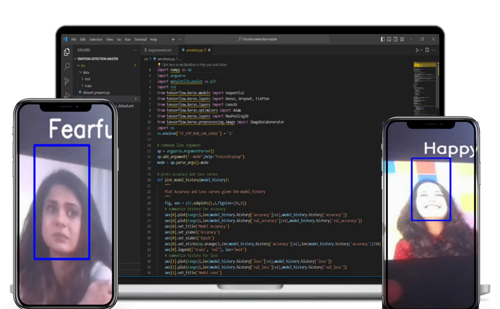

# LookSense - A Facial Expression Recognition

## Introduction
Employing deep convolutional neural networks, this project seeks to categorize facial expressions into seven distinct emotions. Trained on the FER-2013 dataset, featured at the International Conference on Machine Learning (ICML), the dataset encompasses 35,887 grayscale images of 48x48 dimensions, each portraying one of **seven emotions: anger, disgust, fear, happiness, neutrality, sadness, and surprise.**

## Dependencies

* Python 3, [OpenCV](https://opencv.org/), [TensorFlow](https://wwww.tensorflow.org/)
* To install the required packages, run `pip inistall -r requirements.txt`.

## Basic Usage

The repository is currently compatible with `tensorflow-2.0` and makes use of the Keras API using the `tensorflow.keras` library.

* First, clone the repository and enter the folder

  ```bash
  git clone https://github.com/sudoshivesh/LookSense.git
  cd LookSense
  ```

* Download the [FER-2013](https://www.kaggle.com/datasets/msambare/fer2013?resource=download) dataset inside the `src` folder.

* If you want to train this model, use:

  ```bash
  cd src
  python emotions.py --mode train
  ```

* If you want to view the prediction without training again, I have already given a pre-trained model inside the src folder named as `LookSense/src/model.h5` then run the command:
 
  ```bash
  cd src
  python emotions.py --mode display
  ```

*The folder structure is of the form:
  src:
  * data (folder)
  * `dataset_prepare.py` (file)
  * `emotions.py` (file)
  * `haarcascade_frontalface_default.xml` (file)
  * `model.h5` (file)

* By default, the system can recognize emotions on multiple faces within a live webcam stream. Achieving a test accuracy of 63.2% over 50 epochs, the implementation utilizes a straightforward **4-layer convolutional neural network (CNN)** for efficient emotion detection.

* The snapshot of the output is given below:

  
  

* For any query, You may conatct [Shivesh](https://wwww.linkedin.com/in/sudoshivesh/)
